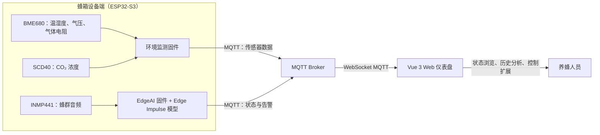

# CoolBeeBox：ESP32-S3 边缘 AI 智能蜂箱监控系统

CoolBeeBox 面向智慧养蜂场景，构建了“感知—边缘推理—云端通信—Web 可视化”一体化监控方案。系统以 ESP32-S3 为设备端核心，采集蜂箱内的温湿度、气压、气体电阻和 CO₂ 浓度；同时通过 INMP441 数字麦克风采集蜂群声音，在设备端运行 Edge Impulse 模型识别蜂群异常状态。数据和识别结果经 Wi-Fi 与 MQTT 发布，前端仪表盘用于实时查看、历史回溯和辅助分析。

> 本仓库不包含有效的 Wi-Fi、MQTT 或模型服务凭据；请在自己的部署环境中配置。

## 系统架构



## 主要能力

- 环境监测：BME680 采集温度、湿度、气压和气体电阻；SCD40 采集 CO₂ 浓度，并将数据合并为 JSON 消息。
- MQTT 通信：两套 ESP-IDF 固件均支持 Wi-Fi Station 联网和 MQTT 发布，可分别上报环境数据和 AI 推理状态。
- 边缘声纹推理：EdgeAI 固件从 INMP441 的 I²S 数据流中读取音频，在 ESP32-S3 上执行 Edge Impulse 分类模型，并对连续识别结果进行滤波。
- Web 可视化：Vue 3 + Vite + Element Plus 前端提供仪表盘、实时监控、历史数据与 AI 分析页面；MQTT.js 通过 WebSocket 订阅实时消息。
- 模块化扩展：环境监测与声纹推理是独立的 ESP-IDF 工程，可以按设备能力分别烧录、验证和迭代。

## 仓库结构

```text
.
├─ firmware/
│  ├─ environment-monitor/          # 环境监测 ESP-IDF 工程
│  │  └─ main/                      # Wi-Fi、MQTT、BME680、SCD40、温控模块
│  └─ edge-ai/                      # 声纹识别 ESP-IDF 工程
│     ├─ main/                      # I²S 采音、推理任务、Wi-Fi、MQTT 模块
│     ├─ coolbeebox-cpp-mcu-v1-impulse-#1/
│     │  ├─ edge-impulse-sdk/       # Edge Impulse 运行时源码
│     │  ├─ model-parameters/       # 模型参数
│     │  └─ tflite-model/           # 编译后的推理模型源码
│     └─ local_train/                # 模型训练、导出与一致性检查脚本
├─ frontend/                         # Vue 3 + Vite 前端工程
│  ├─ src/views/                     # 仪表盘、实时、历史与 AI 页面
│  └─ src/stores/                    # MQTT 与仪表盘状态管理
├─ backend/                          # 后端占位目录
└─ README.md
```

## 固件说明

### 环境监测固件

路径：`firmware/environment-monitor/`

该工程基于 ESP-IDF，主入口为 `main/main.c`。启动后依次初始化 NVS、Wi-Fi、MQTT、BME680 和 SCD40。BME680 与 SCD40 通过 I²C 总线读取数据；MQTT 模块将环境信息按 JSON 格式发布到 `device/coolbee/sensors`。温控逻辑位于 `main/temp_control.c`。

### EdgeAI 声纹推理固件

路径：`firmware/edge-ai/`

该工程同样基于 ESP-IDF，主入口为 `main/main.cpp`。INMP441 以 I²S 单声道方式连接，采集的 PCM 音频被送入 Edge Impulse 分类器。工程已包含 CMake 所依赖的生成式推理 SDK 和 TFLite 模型源码，因此不需要额外下载这部分模型代码。推理结果通过 MQTT 发布到 `device/coolbee/edgeai`，在线状态发布到 `device/coolbee/edgeai/status`。

### 构建前准备

1. 安装与项目匹配的 ESP-IDF 工具链，并在终端中执行 ESP-IDF 导出脚本。
2. 进入目标固件目录，例如 `firmware/environment-monitor` 或 `firmware/edge-ai`。
3. 使用 `idf.py set-target esp32s3` 设置目标芯片，并使用 `idf.py build` 构建。
4. 使用 `idf.py -p <串口> flash monitor` 烧录并查看日志。

`managed_components/`、构建目录和 Python 虚拟环境均不纳入版本控制。ESP-IDF 会依据各工程的 `dependencies.lock` 恢复托管组件。

## 配置与安全

固件源码中只保留了安全占位值。部署前请通过本地、未提交的构建配置向下列宏注入实际信息：

| 配置项 | 用途 |
| --- | --- |
| `MY_WIFI_SSID` | Wi-Fi 名称 |
| `MY_WIFI_PASS` | Wi-Fi 密码 |
| `COOLBEE_MQTT_URI` | MQTT Broker 地址，例如 `mqtt://host:1883` |
| `COOLBEE_MQTT_USERNAME` | MQTT 用户名 |
| `COOLBEE_MQTT_PASSWORD` | MQTT 密码 |

不要将真实凭据写回源代码、`sdkconfig`、提交历史或前端静态文件。根目录 `.gitignore` 已忽略 `.env`、私钥、构建产物、依赖下载目录和训练临时数据。前端 MQTT 密码默认为空，应在前端配置界面中填写。DeepSeek 等第三方 API 密钥仅应保存在用户浏览器的本地存储或由后端安全代理。

## 前端运行

前端路径：`frontend/`

需要 Node.js（建议使用当前维护中的 LTS 版本）。安装依赖并启动开发服务器：

```bash
npm install
npm run dev
```

生成生产构建：

```bash
npm run build
```

前端的 MQTT 连接逻辑位于 `frontend/src/stores/mqtt.js`；请将 Broker 的 WebSocket 地址、端口、用户名和密码配置为自己的服务。前端包含历史记录和 AI 分析界面，但历史数据/API 服务需要由实际后端提供。

## 后端状态

原始 `CoolBeeBox-API` 目录中的 `.env`、`docker-compose.yml`、`package.json` 和 `server.js` 均为空文件，因此没有可迁移的后端实现。本仓库在 `backend/` 中保留了占位说明。若后续补充 API，建议将 MQTT 消费、数据持久化、历史查询、CSV 导出和模型 API 代理集中放置于该目录，并通过 `.env.example` 提供非敏感配置模板。

## 开发建议

- 设备和前端应使用统一的 MQTT 主题命名、JSON 字段定义与版本号，避免多固件版本并行时产生兼容性问题。
- 为生产部署启用 TLS MQTT、独立设备账号和最小权限主题 ACL，不要继续使用共享测试账号。
- 模型训练脚本依赖独立的数据集和 Python 环境；训练数据、临时音频与大体积实验产物应保存于仓库外或使用专用数据版本管理。
- 提交前请确认 `git status` 中不含 `.env`、日志、固件二进制、私钥和真实传感器/设备访问凭据。
